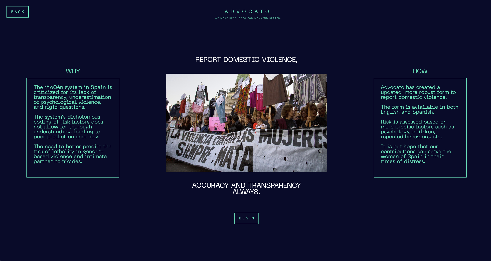
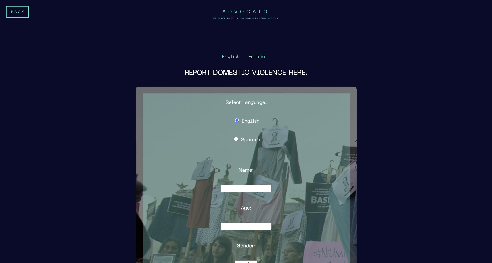
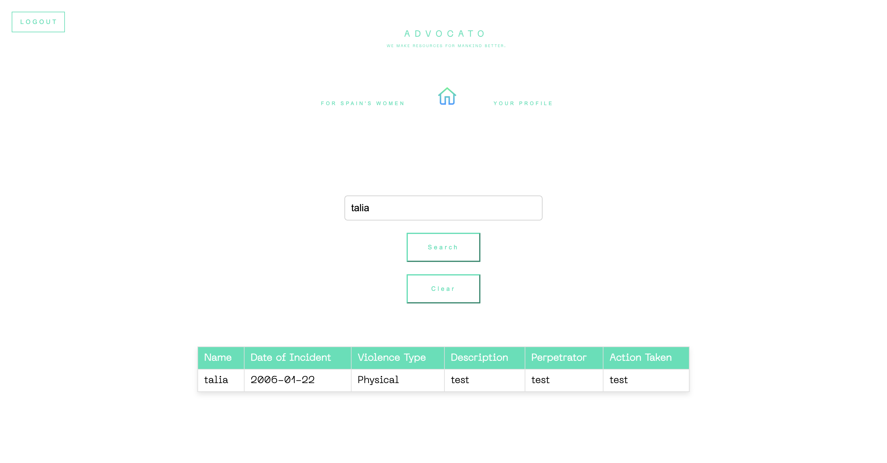
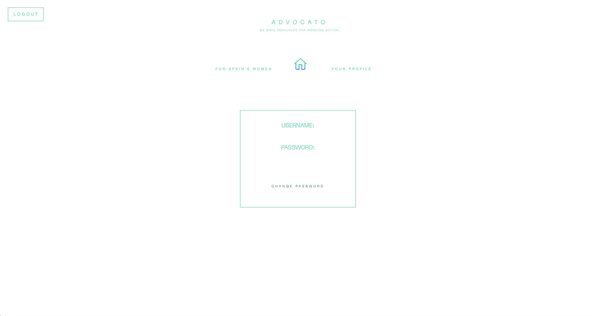

# Advocato: For Enhanced Domestic Violence Assessment in Spain

## Overview

Advocato is an online platform designed to support the assessment and management of domestic violence cases in Spain. Built with Django, this project aligns with the United Nations Sustainable Development Goals (SDG), particularly SDG 5: Gender Equality and SDG 16: Peace, Justice, and Strong Institutions. Advocato aims to improve the accuracy and comprehensiveness of domestic violence risk assessments, starting with Spain and potentially expanding to other regions.

This project was developed as a submission for the United Nations SDG Gamechangers Award, under the theme of "C4: Peace" as a Youth submission (at the time of creating this, I was 18)! The goal is to create a reliable tool that assists law enforcement and social workers in evaluating the risk of domestic violence cases more effectively.

## Project Purpose

The primary purpose of Advocato is to address the shortcomings in the current VioGén system used in Spain. The existing system has been criticized for its lack of transparency, underestimation of psychological violence, and rigid question structures that do not allow for a nuanced understanding of risk factors. Advocato seeks to:

- **Enhance Risk Assessment:** Improve the accuracy of domestic violence risk predictions by incorporating a broader range of psychological and situational factors.
- **Support Victims:** Provide victims with a user-friendly tool to assess their situation and receive guidance on available resources.
- **Assist Law Enforcement:** Offer a more comprehensive and scalable assessment tool to law enforcement and social workers.

## Project Features

### 1. Django Website
- **Platform:** Django is used for the overall website framework, user management, and integration of forms and AI-based tools.
- **User Management:** The platform includes a user authentication system, allowing secure access and tracking of responses.
- **Form Integration:** Advocato hosts a redesigned domestic violence danger assessment form that includes scalable risk factors, detailed explanations, and support for multiple languages.

### Index Page


### Spain Form Page


### Form


### 2. User Dashboard
- **Dashboard Overview:** Advocato includes a user dashboard that allows authorized personnel to view and analyze the responses from the assessment forms. 
- **CSV Data Storage:** All form submissions are saved into a CSV file, which can be queried to extract more detailed information such as the victim’s contact info, history of violence, and other relevant data.
- **Data Querying:** The dashboard provides search and filtering options, allowing users to drill down into the data based on various criteria like risk level, type of violence, or region. This feature supports more targeted and effective intervention strategies.

### Form Query


### Profile


### 3. AI Chatbot
- **Purpose:** The chatbot guides users through the assessment form, providing explanations and assistance in Spanish.
- **Technologies Used:** The chatbot backend is built using FastAPI, with AI algorithms for natural language processing (NLP) and prediction. TensorFlow is used to handle the language model and AI components.
- **IMPORTANT: Development Status:** The chatbot is still in the development stages, with ongoing work to improve its accuracy and usability. Currently, there is an issue with the MultiHeadAttention layer in the model.py file, which is causing a mismatch in tensor shapes. This error needs to be resolved for the chatbot to function effectively.

### 4. Improved Risk Assessment
Advocato enhances the risk assessment process by considering a broader set of factors and applying a more nuanced analysis of the user’s situation. The core of this process is encapsulated in the `rank_user_risk` function, which evaluates the user's responses to determine the level of danger they may be in. 

```python
def rank_user_risk(cleaned_data):
    """
    Function to rank the risk level based on the user's Spain Domestic Violence Form Submission.
    The function checks various sections of the form to determine the risk level using the same risk
    classifications as the Police of Spain with VioGen.
    """
    risk_level = 'unappreciated'

    yes_count = 0
    risk_assessment_fields = [
        'access_to_weapons', 
        'threats_made', 
        'victim_afraid', 
        'children_dependents', 
        'safe_place'
    ]
    for field in risk_assessment_fields:
        if cleaned_data.get(field) == 'Yes':
            yes_count += 1

    history_of_violence = cleaned_data.get('history_of_violence') == 'Yes'
    support_needed = (
        cleaned_data.get('medical_attention') == 'Yes' or 
        cleaned_data.get('safe_housing') == 'Yes' or 
        cleaned_data.get('legal_help') == 'Yes' or 
        cleaned_data.get('counseling') == 'Yes'
    )
    other_responses_length = sum([
        len(cleaned_data.get('previous_incidents', '').split()), 
        len(cleaned_data.get('action_taken', '').split()), 
        len(cleaned_data.get('other_support', '').split()), 
        len(cleaned_data.get('additional_information', '').split())
    ])

    if yes_count > 2:
        risk_level = 'extreme'
    elif yes_count == 2:
        risk_level = 'high'
    elif history_of_violence or support_needed:
        risk_level = 'medium'
    elif other_responses_length > 10:
        risk_level = 'medium'
    elif yes_count == 1:
        risk_level = 'low'
    
    return risk_level
```

This function goes beyond simple yes/no answers by considering the context and depth of each response, resulting in a more accurate assessment of the user’s risk level.

## Languages and Technologies Used

- **Python:** Core programming language used for backend development and AI model implementation.
- **Django:** Framework for the website, handling user management, form integration, and overall site architecture.
- **FastAPI:** Used for developing the chatbot backend and handling API requests.
- **TensorFlow:** Employed for AI model development, particularly in the NLP tasks for the chatbot.
- **HTML/CSS/JavaScript:** Frontend technologies for creating the user interface and interactive elements of the site.

## Why This Project Was Created

This project was created as a response to the shortcomings in existing domestic violence assessment tools, particularly the VioGén system in Spain. By participating in the United Nations SDG Gamechangers Award, this project aims to contribute to global efforts in enhancing gender equality and peace. Advocato is designed to be a scalable solution that can be adapted to different regions and types of social assistance forms in the future.

## Current Issues

The chatbot component is currently facing an issue with the MultiHeadAttention layer in the model.py file. The error is related to a tensor shape mismatch during the model's processing stages, which needs to be resolved for the chatbot to function correctly.

## Contact and Collaboration

For more information or to collaborate on this project, please contact:

**kusmire@bc.edu**
---

This project is a step towards improving the tools available for assessing and managing domestic violence cases. It is an ongoing effort, and contributions are welcome to help refine and expand Advocato's capabilities.
